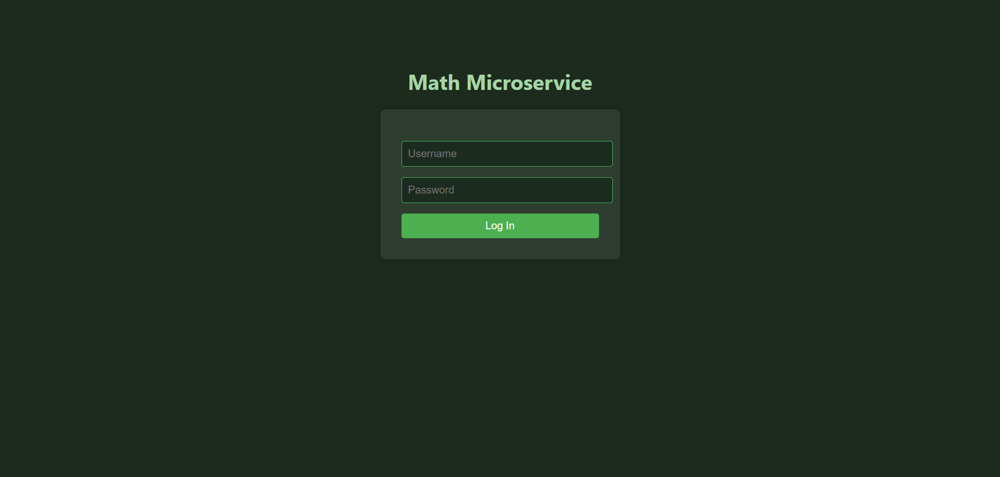
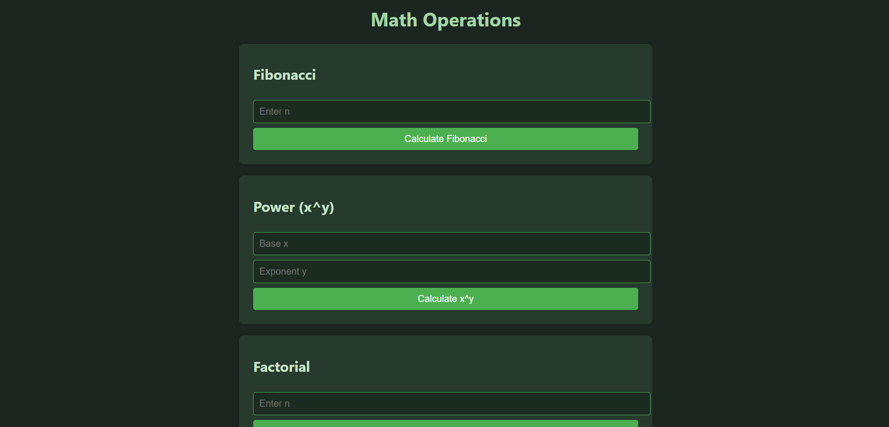

# 📐 Math Microservice

This project is a fully containerized microservice that exposes **secure mathematical operations** through a REST API. It demonstrates modern backend development principles like:
- FastAPI for performance and type-safe API design
- JWT for stateless authentication
- Prometheus for real-time metrics
- SQLite for simple data persistence
- Docker for consistent, repeatable deployment
- Static HTML frontend for human-friendly interaction

It's ideal for educational use, internal tools, or expanding into a larger system.

---

## ✨ Features

- 🔐 **JWT Authentication** — all endpoints are protected by token-based access
- ➕ **Mathematical Endpoints** — power (`x^y`), factorial (`n!`), and Fibonacci
- 💻 **Frontend Interface** — HTML pages to perform auth and operations in-browser
- 📊 **Prometheus Monitoring** — metrics exposed at `/metrics` for DevOps
- 🗃️ **SQLite Logging** — every user action is saved for auditing/debugging
- 🐳 **Dockerized** — easily run it anywhere with a single command

---

## 🖼️ Interface Overview

### 🔑 Login Page
Login with your credentials to get a JWT token.

### 🧮 Math Interface
Input values and run secure math operations using your token.

> These HTML pages are served automatically at `/static/login.html` and `/static/math.html`.

